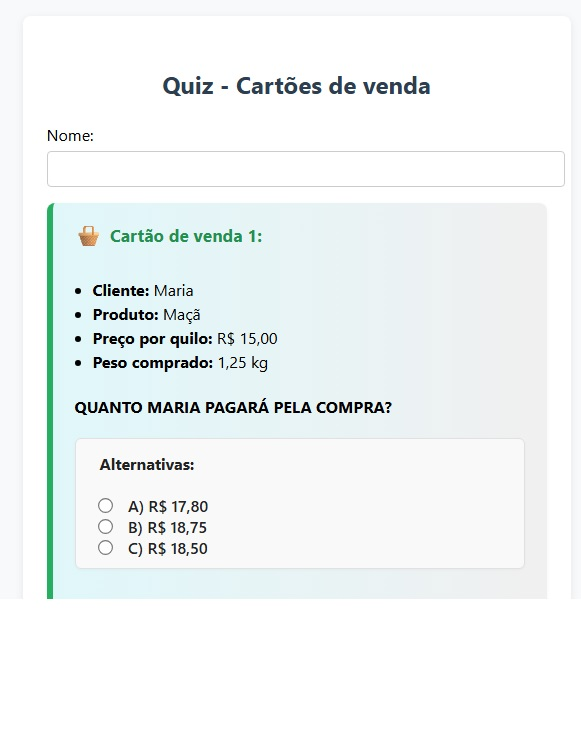
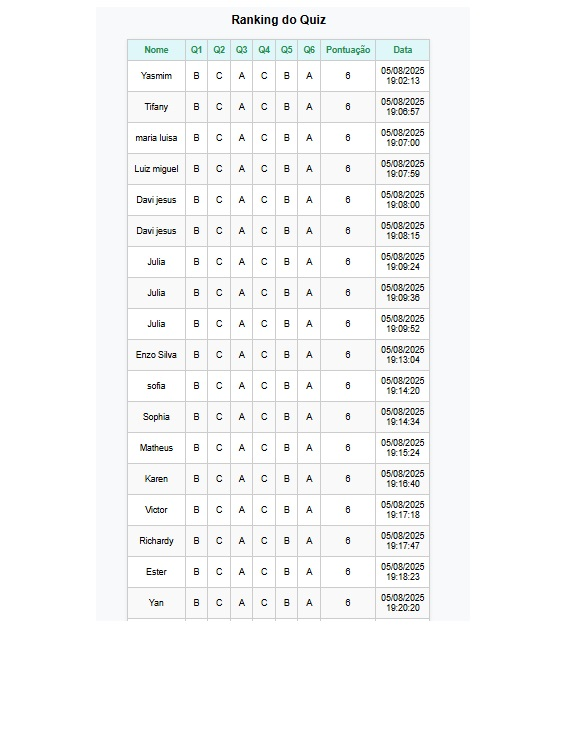

# Cartões - Projeto Matemática na Feira

Este projeto é um QUIZ utilizado no projeto "Matemática na Feira", voltado para turmas do 7º ano do Ensino Fundamental da rede pública.

## Cartões de Venda (Situações-problema)

Os alunos desenvolveram situações-problema para os visitantes resolverem, como simulações de compras com preços, pesos e saldo.

Os visitantes que acertaram todas as perguntas ganharam um bombom.

Material de apoio:
- Cartões de venda elaborados pelos alunos.
- Bloco de papel para os visitantes realizarem cálculos, se necessário.
- Quiz digital disponibilizado via QR Code.

Exemplo:

Cliente: Maria
Produto: Maçã
Preço por quilo: R$15,00
Peso comprado: 1,25 kg
Saldo no cartão: R$20,00	

•	Quanto Maria pagará pela compra?
(A)	R$ 17,75
(B)	R$ 18,75
(C)	R$ 18,25

## Descrição técninca

Este projeto consiste em um sistema simples para registro e ranking de respostas, utilizando arquivos PHP e CSV.

## Estrutura do Projeto

- `index.html`: Página principal do sistema.
- `ranking.php`: Exibe o ranking das respostas.
- `respostas.csv`: Arquivo onde as respostas são armazenadas.
- `salvar.php`: Script responsável por salvar as respostas no arquivo CSV.

## Como usar

1. Abra o arquivo `index.html` em seu navegador para acessar o sistema.
2. As respostas enviadas são salvas em `respostas.csv`.
3. O ranking pode ser visualizado acessando `ranking.php`.

## Requisitos

- Servidor web com suporte a PHP (ex: XAMPP, WAMP, MAMP ou servidor Linux com Apache/Nginx e PHP).

## Observações

- Certifique-se de que o servidor tenha permissão de escrita no arquivo `respostas.csv`.
- Para testar localmente, coloque todos os arquivos em uma pasta dentro do diretório do seu servidor web.

---

## Disponível em:

https://matematica360.com.br/cartoes/
